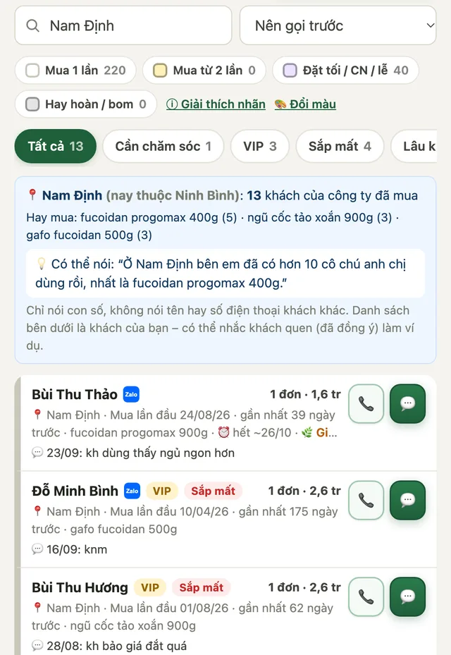
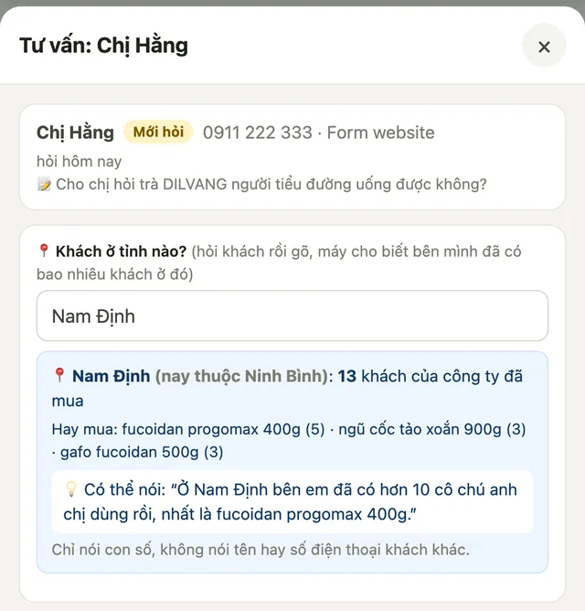

CRM là nơi làm mọi việc với **đơn hàng** và **khách hàng**: xác nhận đơn, gửi tin chăm sóc, theo dõi người hỏi mua, xem doanh số của mình. Dữ liệu vẫn lưu trong Google Sheet của công ty, nhưng bạn không cần mở Sheet.

Mở tại **[crm.thucduonglanh.vn](https://crm.thucduonglanh.vn)**, trên điện thoại hoặc máy tính đều được.

## Đăng nhập

1. Mở [crm.thucduonglanh.vn](https://crm.thucduonglanh.vn), nhập **email đã đăng ký với công ty**, bấm **Gửi mã đăng nhập**.
2. Mở hộp thư, tìm email **“… là mã đăng nhập CRM Thực Dưỡng Lành”**. Không thấy thì xem mục **Spam** hoặc **Quảng cáo**.
3. Nhập **mã 6 số**. Máy tự đăng nhập khi gõ đủ 6 số.

Mã dùng được trong **10 phút**. Đăng nhập xong, máy nhớ bạn trong **30 ngày**. Hết hạn thì làm lại từ bước 1.

> **Báo “Email này chưa được cấp quyền”?** Nhờ anh Sơn hoặc quản lý thêm email của bạn (mục Cài đặt → Nhân sự). Xin mã quá 5 lần thì phải đợi 15 phút.

**Đưa CRM ra màn hình chính điện thoại** (mở nhanh như một ứng dụng):

- **iPhone** (Safari): bấm nút **Chia sẻ** (ô vuông có mũi tên lên) → **Thêm vào MH chính**.
- **Android** (Chrome): bấm **⋮** góc trên → **Thêm vào màn hình chính** (hoặc **Cài đặt ứng dụng**).

## Các tab trong CRM

| Tab | Dùng để |
| --- | --- |
| **Hôm nay** | Danh sách việc cần làm trong ngày. Mở tab này đầu tiên mỗi sáng. |
| **Khách đã mua** | Người đã mua ít nhất 1 đơn: chăm sóc sau bán, mời mua lại. Tìm khách, xem lịch sử mua và chăm sóc. |
| **Đơn hàng** | Xác nhận, giao hàng, nhận tiền, sửa đơn, tạo đơn cho khách đặt qua Zalo hoặc điện thoại. |
| **Khách hỏi** | Người **hỏi nhưng chưa mua** (số quảng cáo, Ladi ebook, form web, nhắn Zalo hỏi giá): tư vấn để chốt đơn đầu tiên. Chốt đơn xong, khách tự sang tab Khách đã mua. |
| **Hiệu quả** | Doanh số, mục tiêu tháng, kết quả chăm sóc của bạn. |
| **Cài đặt** | Đăng xuất. Quản lý sửa chu kỳ dùng, mẫu tin nhắn, nhân sự ở đây. |

- Chấm đỏ trên tab là số việc đang chờ.
- Nút **⟳** góc trên bên phải: tải lại dữ liệu mới nhất, ví dụ khi đồng nghiệp vừa cập nhật.
- **Bạn chỉ thấy khách mình phụ trách.** Quản lý thấy toàn bộ. Khi gõ số điện thoại của khách đang do người khác phụ trách, CRM chỉ báo tên người đó và không cho thao tác. Muốn đổi người phụ trách thì nhờ quản lý chuyển.
- Danh sách việc ở tab Hôm nay **chỉ có khách của bạn**. Khi công ty dùng chế độ **Kho chung**, khách *chưa ai phụ trách* nằm riêng ở mục **🧺 Kho chung** cuối tab Hôm nay. Bấm **✋ Nhận khách này**, hoặc chăm sóc hay xác nhận đơn của khách đó, là khách thuộc về bạn.

### Nhận thông báo Telegram riêng

Vào **Cài đặt → 📲 Thông báo Telegram riêng** → bấm **Kết nối Telegram** → **① Mở Telegram** → trong Telegram bấm **Start / Bắt đầu** → quay lại CRM bấm **② Tôi đã bấm Start**. Bot gửi tin xác nhận là xong.

Từ đó bạn nhận riêng: **đơn mới của khách mình phụ trách**, **khách hỏi mới được giao**, và **danh sách việc lúc 8h sáng**. Nhóm Telegram chung chỉ dành cho quản lý.

## Tab Hôm nay

- **Trên cùng:** số khách cần chăm sóc hôm nay, thanh tiến độ và nút **▶ Bắt đầu gọi lần lượt**. Mỗi ngày CRM đưa ra tối đa **30 khách** (đổi ở **Cài đặt → Số khách chăm sóc mỗi ngày**), khách quan trọng trước: hẹn gọi lại → hỏi nhận hàng → sắp hết hàng → việc bị trễ → các việc khác. Khách chưa tới lượt tự dời sang hôm sau.
- **Ô nhỏ:** đơn mới, khách hỏi, việc đã làm, mục tiêu tháng. Bấm để mở đúng danh sách. Quản lý thấy thêm doanh thu và khách mới của tháng.
- **1️⃣ Đơn mới – gọi khách xác nhận** (chỉ hiện khi có), kèm **Chuyển khoản chưa nhận tiền**.
- **2️⃣ Chăm sóc khách:** chia nhóm theo loại việc (xem [bảng các loại việc](#cac-loai-viec-cham-soc)). Nhóm **thu gọn**, bấm vào mới mở. Mỗi khách 1 dòng với nút **📞 Gọi · 📵 KNM · 💬 Chăm sóc**.
- **3️⃣ Khách hỏi cần liên hệ.**
- Cuối trang: **✅ Đã làm hôm nay** (bấm để mở).

### Gọi lần lượt

Bấm **▶ Bắt đầu gọi lần lượt**: CRM mở **từng khách một** (tên, sản phẩm, 2–3 lần chăm sóc gần nhất, tin nhắn mẫu). Gọi hoặc nhắn xong, bấm **1 nút kết quả**, CRM **tự sang khách tiếp theo** (“Khách 3 / 24”). **⏭ Để sau** bỏ qua khách đó trong lượt này; **✕** để dừng.

## Xử lý đơn hàng

Tab **Đơn hàng** mở sẵn mục **⚡ Cần xử lý**, chỉ gồm những đơn cần làm, chia nhóm:

| Nhóm | Đơn nào | Việc cần làm |
| --- | --- | --- |
| 🆕 **Chờ xác nhận** | Đơn mới | Gọi khách, bấm **✅ Xác nhận** |
| 📦 **Chờ gửi hàng** | Đã xác nhận, chưa có mã vận đơn | Đóng hàng, bấm **📦 Nhập mã VĐ** |
| 🚚 **Giao lâu chưa tới** | Đã gửi quá 5 ngày mà vẫn Đang giao | Gọi hỏi khách, giục bưu cục để tránh hoàn |
| 💳 **Chưa nhận tiền** | Chuyển khoản chưa thấy tiền về | Kiểm tra tài khoản, mở đơn bấm “đã nhận tiền” |
| ↩ **Hoàn gần đây** | Đơn hoàn (đặt trong 3 tuần) | Gọi hỏi lý do, giữ khách |

Mỗi đơn 1 dòng: **📍 tỉnh giao đến**, ngày đặt, thanh toán, sản phẩm, mã vận đơn, **🚚 số ngày đang giao** (màu cam ⚠️ khi quá 5 ngày), 1 nút đúng việc tiếp theo và nút 📞.

**Số ngày đang giao** tính từ **ngày gửi hàng**: CRM tự ghi ngày gửi khi bạn bấm **Đang giao** hoặc nhập mã vận đơn. Đơn cũ chưa có ngày gửi (vd đơn nhập từ file) thì tính từ ngày đặt; rê chuột vào ô số ngày để xem tính từ ngày nào. Khách đã nhận hàng thì nhớ bấm **📬 Đã giao** để đơn không còn bị báo giao lâu.

Bấm vào dòng để mở đơn (Zalo, sửa đơn, ghi chú…). Thẻ **📋 Tất cả đơn** để tra cứu, chọn **Hôm nay / 7 ngày / Tháng này** và trạng thái. Đầu trang có số đơn và doanh thu hôm nay, số đơn đang giao, tỷ lệ hoàn tháng này.

Đơn khách đặt trên web tự vào CRM và báo lên Telegram. Mỗi đơn đi qua các trạng thái:

**Mới → Đã xác nhận → Đang giao → Đã giao** (hoặc **Huỷ**)

1. **Gọi khách xác nhận.** Bấm **📞 Gọi** hoặc **Zalo** ngay trên thẻ đơn. Đơn có ghi chú **“Kiểm tra địa chỉ”** thì hỏi lại khách phường, xã cho chính xác. Xong bấm **✅ Xác nhận**.
2. **Đơn chuyển khoản.** Mở tài khoản VCB, thấy tiền về **đúng số tiền**, nội dung có **mã đơn** (ví dụ TDL2609271234), thì mới mở đơn bấm **💳 Xác nhận đã nhận tiền**. Chưa thấy tiền thì đơn nằm ở mục *Chuyển khoản chưa nhận tiền* để nhắc.
3. **Gửi hàng.** Mở đơn, mục **Vận chuyển**: chọn đơn vị vận chuyển, nhập **mã vận đơn**, bấm **Lưu vận đơn**. Đơn tự chuyển sang **Đang giao**. Nút **🔎 Tra cứu hành trình** mở trang của hãng vận chuyển (mã đã được copy sẵn).
4. **Khách nhận hàng**: bấm **📬 Đã giao**.
5. **Huỷ đơn**: mở đơn, chọn **Huỷ**, ghi lý do. Đơn huỷ không tính vào doanh số.

Các nút khác khi mở đơn:

- **📋 Copy thông tin giao hàng**: copy tên, số điện thoại, địa chỉ, sản phẩm, tổng tiền để dán vào app vận chuyển.
- **✏️ Sửa đơn**: đổi sản phẩm, số lượng, địa chỉ, phí ship. Số đơn, tổng chi của khách tự tính lại.
- **Ghi chú đơn**: ghi những điều cần nhớ, ví dụ “giao giờ hành chính”.
- **Nhân viên bán** (quản lý mới sửa được): người được tính doanh số của đơn.

> **Tổng tiền** đã gồm phí ship: đơn dưới 300.000đ cộng 30.000đ, từ 300.000đ được miễn phí.
>
> **Bấm nhầm trạng thái?** Mở đơn, chọn lại trạng thái đúng. Mọi thay đổi đều được ghi lịch sử.

## Lên đơn (giống sheet VTG_lendon)

Vào **Đơn hàng → ＋ Tạo đơn**, hoặc bấm **＋ Tạo đơn** trong hồ sơ khách. Các ô xếp theo đúng thứ tự trên Sheet:

1. **SĐT, tên khách**. Khách cũ thì CRM tự điền thông tin. Khách có nhãn ⚠️ *Bom hàng* thì CRM cảnh báo.
2. **Địa chỉ**: dán nguyên 1 dòng, CRM tự nhận ra phường và tỉnh. Nhận sai thì bấm *Sửa tỉnh / phường*.
3. **Sản phẩm + số lượng**: gõ vài chữ rồi chọn trong danh sách gợi ý.
4. **🎁 Quà tặng + số lượng**.
5. **Số tiền thu khách**: gõ `1800000`, `1tr8` hoặc `1,8tr` đều được. Giá linh động, CRM chỉ nhắc giá niêm yết để tham khảo.
6. **Ca** (Ngày / Tối-CN / Lễ): CRM tự chọn theo giờ lên đơn, sửa được.
7. Bấm **📋 Copy nội dung lên đơn** để gửi bên vận chuyển. **Mã đơn** tự tạo theo kiểu cũ, ví dụ *Phuong300926-01*.

Trong hồ sơ khách, ô **Ghi nhanh hôm nay** tự thêm ngày ở đầu dòng, giống cách ghi trên Sheet: *“30/09: kh dùng ok, hẹn cuối tháng lấy tiếp”*. Nhật ký chăm sóc cũ từ file của bạn nằm ngay bên dưới.

### Chăm sóc, tỉnh thành và lý do từ chối (tab Hiệu quả)

- **💬 Chăm sóc khách:** lượt chăm sóc và **% kết nối** (khách nghe máy / trả lời), **chăm sóc ra đơn** (khách được chăm sóc đã mua trong 14 ngày sau đó), **khách quay lại mua**, **tỷ lệ hoàn đơn**, **VIP sắp mất chưa gọi** (bấm để mở danh sách).
- **📍 Khách theo tỉnh / thành:** biểu đồ tỉnh nào nhiều khách / doanh thu nhất, gộp theo 34 tỉnh mới (rê chuột để xem tỉnh cũ, vd Hưng Yên gồm cả Thái Bình). Chọn *Khách mới tháng này* để xem khách mới đến từ đâu.
- **🙅 Lý do khách chưa mua / từ chối:** máy tự gom ghi chú khi chăm sóc thành các nhóm (hết tiền, còn hàng, dùng sản phẩm khác, người nhà quyết định, sức khoẻ / đi vắng, chưa thấy hợp, chê giá, bận…) kèm câu khách nói. Chọn *Toàn bộ* để xem cả ghi chú cũ từ file Sheet. Muốn số liệu đúng, khi gọi nhớ gõ vài chữ khách nói vào **Ghi chú lần này**.

### Báo cáo ngày gửi nhóm Zalo

Cuối ngày bấm **📋 Báo cáo cuối ngày (gửi Zalo)** ở tab **Hôm nay** (hoặc **Hiệu quả → 📋 Báo cáo ngày**). CRM tự làm báo cáo đúng mẫu nhóm đang dùng: số đơn và số mới từng dòng (Curcumin, BADD, Fucoidan Pro), sản phẩm khác, đơn từ khách cũ, **tổng doanh thu**, đơn ngoài giờ, đơn hoàn, **KH cũ đã chăm sóc (kết nối)**, **Không nghe máy**, **Lý do từ chối** (lấy từ ghi chú khi bấm *Hết tiền*, *Còn hàng*, *Không dùng nữa*…) và **luỹ kế tháng / % mục tiêu**. Sửa thêm nếu cần, bấm **📋 Copy để dán vào Zalo** rồi dán vào nhóm. Chọn ngày khác để làm báo cáo bù. Quản lý chọn được *Cả nhóm* hoặc từng người.

Tab **Hiệu quả → 📊 Bảng BCDT** tự làm báo cáo doanh thu tháng: theo ngày, theo dòng sản phẩm, khách mới / cũ, đơn hoàn và doanh thu theo ca. Phía trên có sẵn **tỷ lệ chốt** (đơn mới / data mới), **trung bình mỗi đơn khách mới** và **khách cũ**, **% doanh thu từ khách cũ**, **doanh thu ngoài giờ**, **số khách cũ đã chăm sóc / không nghe máy** và **% tiến độ mục tiêu**. Cột nào cả tháng bằng 0 (dòng sản phẩm không bán) thì tự ẩn cho gọn. Bấm **Tải file Excel** để gửi báo cáo.

## Tạo đơn cho khách đặt qua Zalo, điện thoại

Khách đặt qua Zalo, Facebook, điện thoại hay mua tại cửa hàng thì **luôn tạo đơn trên CRM**. Khách sẽ được nhắc chăm sóc và tính doanh số cho bạn như đơn web.

1. Vào **Đơn hàng → ＋ Tạo đơn**. Hoặc mở hồ sơ khách, bấm **＋ Tạo đơn**.
2. Nhập **số điện thoại**. Khách cũ thì tên và địa chỉ tự điền.
3. Chọn **Tỉnh/Thành phố**, gõ **Phường/Xã** (máy gợi ý), nhập số nhà, đường.
4. Chọn **sản phẩm** và số lượng. Giá tự điền, sửa được nếu có giảm giá. Bấm **＋ Thêm sản phẩm** nếu mua nhiều món. Chọn **Sản phẩm khác (tự gõ)** nếu món đó chưa có trong danh sách.
5. **Phí ship** tự tính (30.000đ, miễn phí từ 300.000đ). Có thể sửa tay.
6. Chọn **Khách đặt qua**, **Thanh toán** (COD hoặc chuyển khoản), **Trạng thái**:
    - **Đã chốt với khách**: đã thống nhất xong với khách.
    - **Chưa xác nhận**: cần gọi lại xác nhận sau.
7. Tích **Khách đồng ý nhận tin ưu đãi** chỉ khi khách đã đồng ý.
8. Bấm **Lưu đơn**.

## Chăm sóc khách

### Các loại việc chăm sóc

CRM tự tính ngày cần liên hệ từng khách, dựa vào **ngày khách nhận hàng** và thời gian dùng hết sản phẩm. Ngày nhận hàng là ngày đơn chuyển **Đã giao**, hoặc ngày bạn bấm **📦 Đã nhận, đã HD dùng** khi gọi. Chưa biết ngày nhận thì máy ước tính = ngày đặt + số ngày giao hàng trung bình (mặc định 3 ngày, quản lý sửa ở Cài đặt → Nhóm khách).

| Việc | Khi nào | Nên làm gì |
| --- | --- | --- |
| 📞 **Hẹn gọi lại** | Đến ngày khách đã hẹn | Gọi lại đúng hẹn |
| 📦 **Hỏi nhận hàng, hướng dẫn dùng** | Ngày khách nhận hàng đến 2 ngày sau (chưa rõ ngày nhận: từ ngày đặt + 3 ngày) | Hỏi đã nhận hàng chưa, gửi cách dùng. Bấm **📦 Đã nhận, đã HD dùng** hoặc **🚚 Chưa nhận hàng** (2 ngày sau tự nhắc lại) |
| ⏰ **Sắp hết / đã hết sản phẩm** | Gần ngày khách dùng hết | Nhắc đặt lại, gợi ý thêm món để đơn từ 300.000đ được miễn phí ship |
| 💬 **Xin cảm nhận** | 14 ngày sau khi nhận hàng | Hỏi cảm nhận, xin phép chia sẻ |
| 🌿 **Giới thiệu sản phẩm phù hợp** | 30 ngày sau khi nhận hàng | Giới thiệu sản phẩm khác hợp với khách |
| 💌 **Mời quay lại** | 60 ngày sau khi nhận hàng, chưa mua lại | Hỏi thăm, gửi ưu đãi khách cũ |
| 🔁 **Khách cũ lâu chưa gọi** | Quá 30 ngày khách chưa phản hồi (không tính các lần không nghe máy) | Hỏi thăm, hỏi còn hàng không, mời đặt lại |

Việc nào **qua khung mà chưa làm** (ví dụ bạn nghỉ vài hôm) vẫn hiện thêm 7 ngày, kèm dòng **⏳ trễ N ngày**, để không sót khách.

### Cách chăm sóc 1 khách

1. Bấm nút **💬** trên dòng khách (hoặc **▶ Bắt đầu gọi lần lượt** ở tab Hôm nay).
2. **Bước 1 – Gửi tin:** CRM chọn sẵn **mẫu tin** hợp với việc, tự điền tên khách và sản phẩm. Đọc lại, sửa cho tự nhiên. Bấm **📋 Copy tin & mở Zalo**, rồi dán tin vào khung chat Zalo của khách và gửi. Muốn gọi thì bấm **📞 Gọi**.
3. Quay lại CRM. **Bước 2 – Ghi kết quả.** Cách nhanh nhất là **bấm 1 nút**, bấm xong là lưu luôn và máy tự hẹn ngày gọi lại:

    | Nút | Máy ghi | Tự nhắc gọi lại |
    | --- | --- | --- |
    | 📵 **KNM** | knm (không nghe máy) | sau 2 ngày |
    | 📴 **Thuê bao** | thuê bao | sau 3 ngày |
    | 🙅 **Từ chối nghe** | từ chối nghe | sau 7 ngày |
    | 👍 **Dùng ok** | kh dùng ok | không hẹn |
    | 📦 **Còn hàng** | kh còn nhiều | sau 14 ngày |
    | 💸 **Hết tiền** | kh hết tiền, hẹn tháng sau | sau 30 ngày |
    | 🛒 **Đặt lại** | kh đặt lại, rồi mở luôn form tạo đơn | không hẹn |
    | 🚫 **Không dùng nữa** | kh không dùng nữa | không hẹn |

    Có gõ thêm vào **Ghi chú lần này** thì máy ghi kèm. Ở tab Hôm nay, thẻ khách có sẵn nút **📵 KNM**: gọi không được thì bấm ngay, không cần mở hộp chăm sóc.

    Hoặc tự chọn 1 kết quả bên dưới:
    - **Đã đặt lại**: khách đặt thêm. Nhớ tạo đơn nếu khách đặt qua Zalo.
    - **Hẹn gọi lại**: chọn ngày hẹn (máy gợi ý 2 ngày sau). Đến ngày, khách tự hiện lại ở tab Hôm nay.
    - **Không nghe máy**: gọi hoặc nhắn mà khách chưa trả lời.
    - **Đã hỏi thăm**: đã nói chuyện, khách chưa cần mua.
    - **Không có nhu cầu**: khách không muốn mua thêm.
4. Ghi vài chữ vào **Ghi chú lần này** (khách nói gì, cần gì), bấm **Lưu kết quả**. Khách rời khỏi danh sách hôm nay.

**Lịch sử chăm sóc** trong hồ sơ khách gồm cả các lần ghi trên CRM và các ghi chú cũ nhập từ Sheet (ví dụ “21/7 kh nhận hàng, 9/8 knm”), sắp theo ngày, mới nhất ở trên.

> **Khách chưa đồng ý nhận tin ưu đãi** (chưa có nhãn ✓ *Nhận ưu đãi*): vẫn hỏi thăm sức khoẻ, hướng dẫn dùng bình thường, nhưng **không gửi quảng cáo, ưu đãi**. Khách đồng ý thì bấm **☐ Khách đồng ý nhận ưu đãi** trong hồ sơ.

### Khách đã kết bạn Zalo

Biểu tượng **Zalo** (ô vuông xanh có chữ Zalo) cạnh tên khách nghĩa là bạn **đã kết bạn Zalo** với khách, nên nhắn tin chăm sóc được. Khi nhập file Sheet cũ, tên có dấu **(x)** được tự chuyển thành biểu tượng này. (Còn nút **💬** màu xanh lá là nút **Chăm sóc**, không phải Zalo.)

- Kết bạn xong với khách nào, bấm **➕ Đã kết bạn Zalo** ngay trên thẻ khách (hoặc trong hồ sơ). Nếu file Sheet của bạn đang bật ghi ngược, máy tự thêm **(x)** vào tên khách trong file.
- Hộp chăm sóc tự gợi ý: khách đã kết bạn thì **nhắn Zalo trước**, khách chưa kết bạn thì **gọi trước** và nhắc xin kết bạn.
- Tab **Khách đã mua** có bộ lọc **Đã kết bạn Zalo** và **Chưa kết bạn Zalo**.
- Lỡ đánh dấu nhầm: mở hồ sơ khách, bấm **Bỏ đánh dấu đã kết bạn Zalo**.

### 📣 Gửi ưu đãi lần lượt qua Zalo

Ở tab **Khách đã mua**, lọc nhóm muốn gửi (vd **Đã kết bạn Zalo**, VIP, Sắp mất, hoặc gõ tên sản phẩm vào ô tìm), rồi bấm **📣 Gửi ưu đãi lần lượt**:

1. Giữ tích **Chỉ khách đã kết bạn Zalo** và **Chỉ khách đồng ý nhận ưu đãi** (đúng Nghị định 13). Khách lạnh và khách đã nhận chương trình này tự được bỏ ra.
2. Đặt **tên chương trình** (vd “Ưu đãi 10/10”) và soạn tin. Viết **[Tên]**, **[Sản phẩm]** để máy tự điền cho từng khách; nhớ sửa phần “…”.
3. Bấm **▶ Bắt đầu gửi**. Mỗi khách: bấm **📋 Copy tin & mở Zalo** → dán vào khung chat, gửi → quay lại bấm **✅ Đã gửi → khách tiếp**. Khách chưa tiện thì **⏭ Bỏ qua**; bấm **✕** để dừng, lần sau mở lại máy chỉ đưa ra khách chưa gửi.

Mỗi lần gửi được ghi vào lịch sử khách và file Sheet của bạn (“📣 Ưu đãi 10/10”). Mở lại **📣 Gửi ưu đãi lần lượt** để xem **📊 kết quả từng chương trình**: đã gửi bao nhiêu khách, bao nhiêu khách mua trong 14 ngày sau đó. **Không dùng phần mềm tự gửi Zalo hàng loạt** (dễ bị khoá tài khoản); gửi rải trong ngày, không dồn vài trăm tin liên tục.

### Hồ sơ khách hàng

Bấm vào tên khách ở bất kỳ đâu để mở hồ sơ.

Từ trên xuống:

- **Phần đầu:** số điện thoại, người phụ trách, nhãn (Zalo, ✓ Nhận ưu đãi, ⚠️ hay hoàn…) và 4 nút **Gọi · Zalo · Chăm sóc · ＋ Đơn**.
- **Giá trị khách (chữ to):** **Tổng chi · Số đơn · Trung bình mỗi đơn**. Bên dưới: **mua gần nhất** bao lâu rồi, **hay mua** sản phẩm gì, khoảng **bao nhiêu ngày khách mua lại 1 lần**, **ngày dự kiến hết hàng**.
- **Khung vàng:** việc cần làm hôm nay với khách (nếu có) và **lần cuối khách trả lời** (ngày, kết quả, ai gọi). Nếu sau đó gọi mà khách không nghe máy thì ghi rõ số lần.
- **3 thẻ:**
    - **Lịch sử** (mở sẵn): **đơn hàng 🛒 và các lần chăm sóc gộp chung 1 dòng thời gian**, mới nhất ở trên. 📵 = không nghe máy, 📒 = ghi chú cũ từ Sheet.
    - **Đơn hàng:** toàn bộ đơn của khách, kể cả đơn cũ.
    - **Thông tin:** địa chỉ, nguồn, đơn đầu, ngày nhận hàng gần nhất, người giới thiệu, số điện thoại khác, tình trạng sức khoẻ.
- **Ô ✏️ Ghi nhanh** luôn ở đáy màn hình: gõ vài chữ (vd “kh dùng ok, hẹn cuối tháng”) rồi bấm **Lưu** hoặc Enter. Máy tự thêm ngày.
- **⚙️ Sửa thông tin** (bấm để mở): đổi người phụ trách (quản lý), hẹn gọi lại ngày, nhãn màu, sửa ghi chú dài.

**Nhóm khách** (máy tự xếp theo số ngày chưa mua):

| Nhóm | Nghĩa là |
| --- | --- |
| *(không nhãn)* | **Đang dùng**: mua trong 60 ngày gần đây |
| **Sắp mất** | 61–180 ngày chưa mua lại. **Nhóm đáng gọi nhất** |
| **Lâu không mua** | Hơn 180 ngày chưa mua |
| **VIP** (nhãn thêm) | Từ 3 đơn, hoặc tổng chi từ 2.000.000đ (quản lý đổi được mức này) |
| **❄️ Khách lạnh** | Đã nói **không dùng nữa**, hoặc **bom hàng / từ chối nhận**. Không đưa vào danh sách gọi hằng ngày. Khách “không dùng nữa” sau 6 tháng tự quay lại để chào lại 1 lần; đặt đơn mới là hết lạnh |
| **⚠️ hay hoàn** | Hoàn từ 2 lần và số lần hoàn nhiều hơn hoặc bằng số lần nhận, hoặc chưa nhận đơn nào. Khách mua nhiều lần mà chỉ **hoàn 1 lần vẫn là khách tốt** (hồ sơ ghi “↩ 1 lần hoàn”) |

**Đồng ý nhận ưu đãi:** khách nhập từ file Sheet cũ chưa có thông tin này. Khi khách đồng ý nhận tin khuyến mãi, mở hồ sơ bấm **☐ Khách đồng ý nhận ưu đãi**. Khách chưa đồng ý vẫn chăm sóc, hỏi thăm, hướng dẫn dùng bình thường; chỉ tránh gửi tin quảng cáo hàng loạt.

**Danh sách khách** mỗi khách 1 dòng: số đơn · tổng chi, lần mua gần nhất, việc cần làm, **lần chăm sóc gần nhất**, nút 📞 và 💬. Mặc định xếp **Nên gọi trước** (khách có việc hôm nay → VIP sắp mất → chi nhiều). Bộ lọc: Cần chăm sóc · VIP · Sắp mất · Lâu không mua · Có hẹn gọi lại · Chưa kết bạn Zalo · ❄️ Khách lạnh.

**Màu thẻ khách** (máy tự tô, để nhìn là biết loại khách):

| Màu | Nghĩa là |
| --- | --- |
| **Trắng** – *Mua 1 lần* | Khách đã mua 1 đơn. Người **chưa mua** nằm ở tab Khách hỏi |
| **Vàng** – *Mua từ 2 lần* | Khách đã mua lại |
| **Tím** – *Đặt tối / CN / lễ* | Đơn gần nhất đặt buổi tối, Chủ nhật hoặc ngày lễ |
| **Xám** – *Hay hoàn / bom* | Khách hay hoàn (xem trên) hoặc có nhãn bom hàng. Khách thân thiết chỉ hoàn 1 lần không bị tô xám |

Quên nghĩa nhãn nào thì bấm **ⓘ Giải thích nhãn** cạnh hàng nhãn màu (trên máy tính: di chuột vào nhãn để xem chú thích). Nếu khách thuộc nhiều loại thì ưu tiên: nhãn riêng của bạn → xám → tím → vàng → trắng. Bấm vào ô màu phía trên danh sách để chỉ xem khách loại đó.

**Tự đặt màu và nhãn riêng**: vào **Cài đặt → 🎨 Màu phân loại khách** để đổi màu cho từng loại, hoặc bấm **+ Thêm nhãn** để tạo nhãn riêng (ví dụ “Khách sỉ” màu xanh), rồi bấm **Lưu màu & nhãn**. Muốn gắn nhãn cho khách: mở hồ sơ khách → **⚙️ Sửa thông tin** → ô **Nhãn màu** → chọn nhãn → **Lưu thay đổi**. Màu bạn chọn chỉ áp dụng trên máy của bạn, không ảnh hưởng người khác.

Ở tab **Khách đã mua**, gõ tên, số điện thoại, **tỉnh, huyện/xã** hoặc tên sản phẩm để tìm. Gõ nhiều chữ cùng lúc cũng được, vd *Nghệ An progomax* = khách ở Nghệ An đã mua Progomax. Các nút lọc nhanh: *Cần chăm sóc*, *VIP*, *Sắp mất*, *Lâu không mua*, *⏰ Sắp hết hàng* (dự kiến dùng hết trong 7 ngày tới hoặc vừa hết trong 7 ngày qua, nên gọi mời mua lại), *Có hẹn gọi lại*, *Đã kết bạn Zalo*, *Chưa kết bạn Zalo*, *❄️ Khách lạnh*. Ô sắp xếp: *Nên gọi trước* (mặc định), *Mua gần nhất*, *Lâu chưa chăm sóc nhất*, *Chi nhiều nhất*, *Sắp hết hàng*, *Tên A–Z*.

Dưới ô tìm có thêm 2 ô lọc: **💰 Mức chi** (dưới 500k / 500k – 2 triệu / trên 2 triệu) và **🧭 Nguồn** (khách đến từ đâu lần đầu: Facebook, Ladi, website…). Các ô lọc dùng chung được với nút lọc nhanh và ô tìm, vd *Trên 2 triệu* + *Sắp mất* = khách chi nhiều sắp mất. **📣 Gửi ưu đãi lần lượt** chỉ gửi cho đúng danh sách đang lọc. Bấm **Bỏ lọc** để xem lại tất cả.

### Tìm theo tỉnh khi đang tư vấn

Đang tư vấn khách mới, hỏi khách ở tỉnh nào rồi gõ tên tỉnh vào ô tìm ở tab **Khách đã mua** (vd *Nam Định*). Phía trên danh sách hiện khung xanh:

- **Bao nhiêu khách của công ty ở tỉnh đó đã mua**, bao nhiêu người mua từ 2 lần, bao nhiêu người mua trong 30 ngày qua, sản phẩm hay mua nhất ở đó. Gõ tên tỉnh cũ hay tỉnh mới đều được (vd *Nam Định* hay *Ninh Bình*).
- Dòng **💡 Có thể nói** gợi ý câu nói với khách, vd “Ở Nam Định bên em đã có hơn 10 cô chú anh chị dùng rồi…”.
- Gõ tên sản phẩm (vd *progomax*) thì khung cho biết bao nhiêu khách đã mua sản phẩm đó và bao nhiêu % mua lại.
- **Khách hỏi cũng dùng được:** trong hộp **💬 Tư vấn** có ô **📍 Khách ở tỉnh nào?**. Hỏi khách rồi gõ tên tỉnh, khung số liệu hiện ngay, không cần chuyển tab. Bấm **Lưu** thì tỉnh được ghi vào ghi chú của khách, lần sau mở lại là thấy, và ô tìm ở tab **Khách hỏi** tìm được theo tỉnh đó.

- **Chỉ nói con số**, không nói tên hay số điện thoại của khách khác. Danh sách bên dưới là khách của bạn ở tỉnh đó; muốn lấy ai làm ví dụ thì phải được khách đó đồng ý.

## Khách hỏi

**Khách hỏi** và **Khách đã mua** là 2 tab riêng vì cách làm khác nhau: khách hỏi cần **tư vấn để chốt đơn đầu tiên** (đo bằng tỷ lệ chốt), khách đã mua cần **chăm sóc để dùng đều và mua lại** (đo bằng tỷ lệ mua lại). Việc hằng ngày của cả 2 nhóm đều gom ở tab **Hôm nay**.

- **Ô tìm ở tab Khách hỏi** tìm theo tên, số điện thoại, sản phẩm quan tâm, ghi chú và **tỉnh** (tỉnh đã ghi lúc tư vấn). Gõ tên tỉnh hay tên sản phẩm cũng hiện khung số liệu khách đã mua như tab Khách đã mua. Ô **📣 Kênh** lọc theo nơi khách hỏi (Form website, Facebook, Zalo…).
- **Tìm ở tab nào cũng được:** gõ tên hoặc số điện thoại, nếu người đó nằm ở tab kia CRM hiện dòng gợi ý, bấm vào để mở.
- Hồ sơ khách đã mua có cả **lịch sử lúc còn là khách hỏi** (🙋 hỏi qua kênh nào, quan tâm gì) và dòng **Biết đến qua … · chốt sau N ngày** ở thẻ Thông tin.

Là người **hỏi mua nhưng chưa mua**: nhắn Fanpage, Zalo, gọi điện, gửi form trên website, gặp ở sự kiện… Ghi lại để theo đến khi khách mua hoặc từ chối.

**Thêm khách hỏi:** bấm **＋ Thêm khách hỏi**. Nhập số điện thoại, tên, khách đến từ đâu, sản phẩm quan tâm, khách hỏi gì. Số đã có trong danh sách thì CRM ghi nối vào, không tạo trùng.

> Khách gửi **form liên hệ trên website** thì CRM **tự thêm** vào đây, kênh ghi là “Form website”.

**Tư vấn:** mỗi lần nói chuyện với khách, bấm **💬 Tư vấn**.

1. Chọn mẫu tin (khách mới hỏi thì có sẵn mẫu chào hỏi), bấm **📋 Copy tin & mở Zalo**, dán gửi khách.
2. Chọn kết quả:
    - **Đã tư vấn, khách cân nhắc** hoặc **Hẹn liên hệ lại**: máy hẹn sẵn 2 ngày sau, sửa được.
    - **Không nghe máy**: máy hẹn sẵn ngày mai.
    - **Khách chốt mua**: bấm Lưu thì form **tạo đơn mở ra luôn**. Lưu đơn xong, khách chuyển sang “Đã chốt”.
    - **Khách không mua**: bắt buộc chọn **lý do** (giá cao, chưa có nhu cầu, đã mua nơi khác…). Quản lý dùng lý do này để cải thiện cách bán.
3. Ghi chú lần này, bấm **Lưu**.

Khách hỏi hiện ở tab Hôm nay khi: **chưa liên hệ lần nào**, **đến ngày hẹn**, hoặc **đã 3 ngày chưa liên hệ lại**.

## Hiệu quả và mục tiêu tháng

- **Đầu tháng**, bấm **🎯 Đặt mục tiêu** doanh số của bạn. Gõ số hoặc viết tắt, ví dụ `30tr`. Có nút lấy bằng tháng trước cộng 10%.
- **Thanh tiến độ**: vạch đen là hôm nay. Thanh màu vượt vạch đen là đang **đúng tiến độ**. CRM cho biết còn thiếu bao nhiêu và **mỗi ngày cần bán khoảng bao nhiêu**.
- **Bán hàng**: doanh số, giá trị trung bình mỗi đơn, tỷ lệ chốt khách hỏi, phần doanh thu từ khách cũ, so với tháng trước.
- **Chăm sóc khách**: số lượt chăm sóc, tỷ lệ khách trả lời, số khách đặt lại, số khách quá 30 ngày chưa chăm sóc (bấm vào để xem danh sách cần gọi).

Doanh số tính theo **Nhân viên bán** ghi trên từng đơn. Đơn khách tự đặt trên web được tính cho **người đang phụ trách khách đó**.

## Dành cho quản lý

**Quyền trong CRM:**

| Quyền | Làm được |
| --- | --- |
| **Nhân viên** | Chỉ thấy và làm việc với khách mình phụ trách: chăm sóc, xử lý đơn, khách hỏi, xem hiệu quả của mình |
| **Quản lý** | Thấy toàn bộ khách. Thêm: giao / chuyển khách, chọn cách chia khách mới, xem doanh thu cả nhóm, hiệu quả từng nhân viên, đặt mục tiêu cho nhân viên, đổi *Nhân viên bán* trên đơn, sửa chu kỳ dùng và mẫu tin |
| **Quản trị** | Thêm: thêm, khoá nhân sự và đổi quyền |

**Tab Hiệu quả → 👥 Cả nhóm:** doanh thu, mục tiêu cả nhóm, bảng từng nhân viên. Bấm vào 1 người để xem chi tiết và đặt mục tiêu. Có mục **Vì sao khách hỏi không mua** và cảnh báo **đơn chưa có nhân viên bán** (mở đơn để gán).

**Giao khách:**

- Tab **Hôm nay** có mục **🧺 Chờ giao người phụ trách**: khách và khách hỏi chưa ai phụ trách. Chọn tên trong ô *Giao cho…* là xong.
- Mở hồ sơ khách → ô **Người phụ trách** để đổi người.
- **Cài đặt → 👥 Chia khách & phân quyền**:
    - **Khách mới được giao thế nào**: *Tự chia đều* (lần lượt cho những người bật “Nhận khách mới”), *Quản lý giao tay* (khách mới vào mục Chờ giao), *Kho chung* (ai nhận trước được khách). Đổi lúc nào cũng được.
    - **Ai được nhận khách mới**: bật / tắt cho từng người, ví dụ khi nghỉ phép. Cột bên cạnh cho biết người đó đã kết nối Telegram chưa.
    - **Chia đều khách chưa ai phụ trách**: dùng 1 lần cho khách cũ.
    - **Chuyển toàn bộ khách của A sang B**: dùng khi nhân viên nghỉ việc. Khách hỏi đang theo dõi cũng chuyển theo.

**Tab Cài đặt:**

- **Chu kỳ dùng sản phẩm**: khách dùng hết 1 hộp trong bao nhiêu ngày. CRM dùng số này để tính ngày nhắc đặt lại. Tên sản phẩm chỉ cần chứa 1 phần (ví dụ “DILVANG”). Để trống quy cách thì áp dụng cho mọi quy cách. Thực tế khách dùng nhanh hay chậm hơn thì sửa lại cho khớp.
- **Mẫu tin nhắn chăm sóc**: viết **[Tên]** và **[Sản phẩm]** để máy tự thay. Cột *Thời điểm* cần chứa “1 ngày”, “hết”, “14”, “30” hoặc “60” thì CRM mới tự chọn đúng mẫu cho từng việc. Mẫu tin không được hứa hẹn công dụng chữa bệnh.
- **⭐ Nhóm khách**: đặt mức để máy xếp khách **VIP** (mua từ bao nhiêu đơn, hoặc tổng chi từ bao nhiêu tiền) và **Sắp mất** (bao nhiêu ngày chưa mua lại). Bấm **Lưu nhóm khách**, cả nhóm cùng áp dụng.
- **📂 File của sale** (chỉ Quản trị): nhập đơn và nhật ký chăm sóc từ file Google Sheet sale đang dùng. Ô ghi chú kiểu “21/7 kh nhận hàng, 9/8 knm, 16/5 kh hết tiền” được tách thành từng lần chăm sóc có ngày, máy tự đoán năm. Tích **✍️ Ghi kết quả chăm sóc ngược vào file này** thì mỗi lần sale bấm kết quả trên CRM, máy tự viết thêm vào ô ghi chú của khách trong file, ví dụ “, 30/9 knm (hẹn gọi 2/10)”, khoảng 5 phút một lần. Sale vẫn xem đầy đủ trên file của mình. Để dùng được, sale cần **chia sẻ quyền Chỉnh sửa** file cho tài khoản chạy CRM. Kết quả từng lần ghi xem ở tab *Ghi ngược file sale* trong Sheet.
- **Nhân sự được vào CRM** (chỉ Quản trị): thêm email, tên hiển thị, quyền. Nhân viên nghỉ việc thì **bỏ tích “Đang dùng”**, không cần xoá.

## Góp ý cho CRM

Gặp lỗi, chỗ khó dùng hay có ý tưởng làm CRM tiện hơn, bạn cứ góp ý. **Mọi góp ý đều được đọc.**

1. **Chụp màn hình** chỗ đó bằng nút của điện thoại.
2. Bấm nút **💡 Góp ý** trên đầu trang (có ở mọi màn hình).
3. Chọn loại **🐞 Lỗi / 😕 Khó dùng / 💡 Ý tưởng**, gõ vài chữ, bấm **📷 Chọn ảnh** để gửi kèm ảnh vừa chụp (tối đa 3 ảnh; trên máy tính dán bằng Ctrl+V). Bấm **Gửi góp ý**.

Máy tự ghi kèm bạn đang ở màn hình nào, dùng máy gì, nên bạn chỉ cần tả ngắn. Xem trạng thái ở **💡 Góp ý → Góp ý của tôi** (*Mới → Đang làm → Đã xong*). Khi có trả lời, bạn nhận tin qua Telegram riêng (nếu đã kết nối).

**Quản lý:** nút 💡 có số đỏ khi có góp ý mới. Mở **💡 Góp ý → Danh sách góp ý** để xem ảnh, đổi trạng thái và trả lời. Quản trị nhận Telegram kèm ảnh ngay khi có góp ý. Ảnh lưu trong thư mục *Góp ý CRM Thực Dưỡng Lành* trên Google Drive, nội dung lưu ở tab *Góp ý* trong Sheet.

## Câu hỏi thường gặp

**Không nhận được mã đăng nhập?** Xem mục Spam/Quảng cáo. Kiểm tra lại email đã gõ đúng chưa. Đợi 1–2 phút rồi bấm **Gửi lại mã**.

**Báo “Phiên đăng nhập đã hết”?** Đăng nhập lại bằng email như lần đầu.

**Đồng nghiệp đã sửa mà máy tôi chưa thấy?** Bấm nút **⟳** góc trên để tải lại.

**Báo “Mất kết nối mạng”?** Kiểm tra wifi hoặc 4G rồi bấm lại. Riêng kết quả chăm sóc (KNM, Dùng ok…) và ghi chú khách thì không cần bấm lại: CRM tự gửi khi có mạng.

**Góc trên hiện “⏳ Đang gửi 1”?** Việc bạn vừa lưu đang được gửi lên máy chủ. Cứ làm tiếp. Mất mạng thì CRM giữ lại và tự gửi khi có mạng, kể cả khi bạn tắt trang rồi mở lại.

**Cuối trang hiện “⏳ Đang cập nhật…”?** Để mở nhanh, CRM hiện ngay dữ liệu lần trước lưu trên máy bạn, rồi tự tải bản mới trong vài giây. Dữ liệu này tự xoá khi bạn **đăng xuất**. Dùng máy chung thì nhớ đăng xuất khi xong việc.

**Sửa trực tiếp trên Google Sheet mà CRM chưa thấy?** Bấm **⟳** để đọc lại ngay. Nếu không bấm, khoảng 10 phút sau CRM tự thấy.

**Khách đặt lại qua Zalo, tôi đã chọn “Đã đặt lại”, có cần tạo đơn không?** **Có.** Chọn kết quả chỉ ghi lại việc chăm sóc. Phải tạo đơn thì mới có đơn hàng và tính doanh số.

**Một khách có 2 số điện thoại?** CRM nhận diện khách theo số điện thoại. Nên dùng 1 số chính, ghi số còn lại vào *Ghi chú về khách*.
